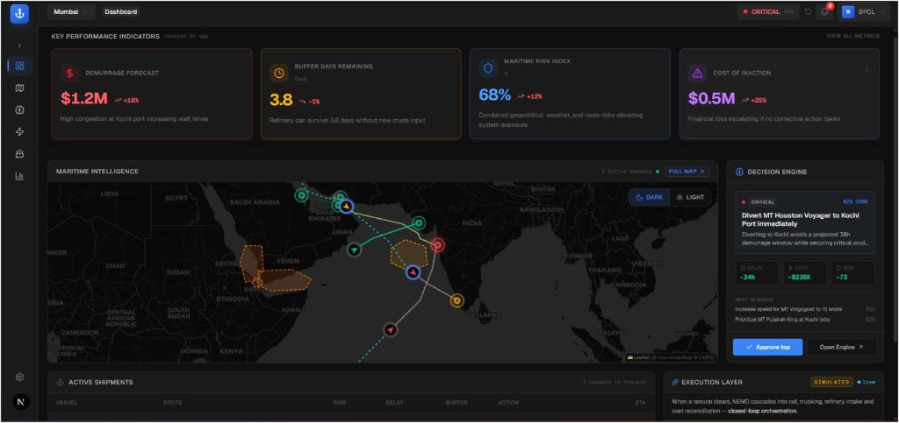
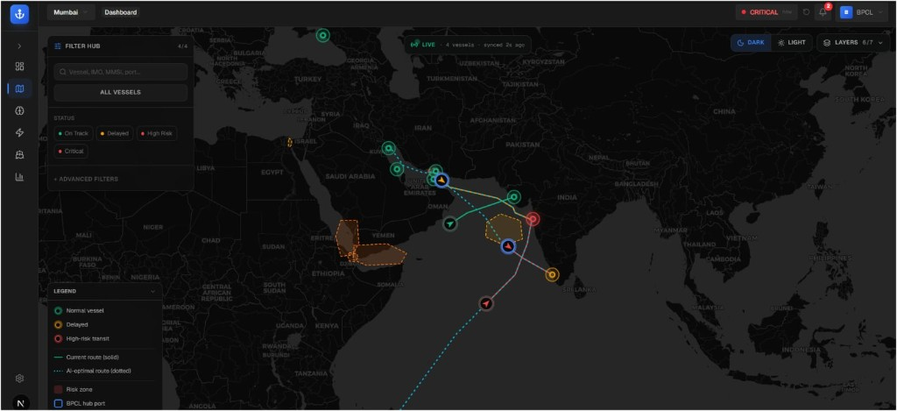
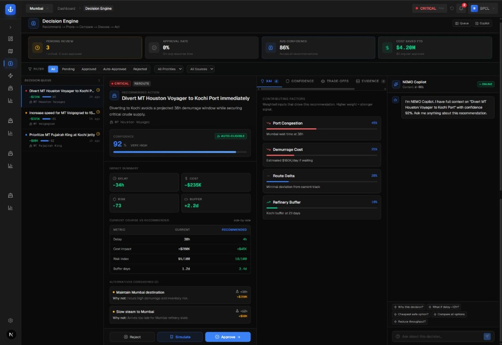
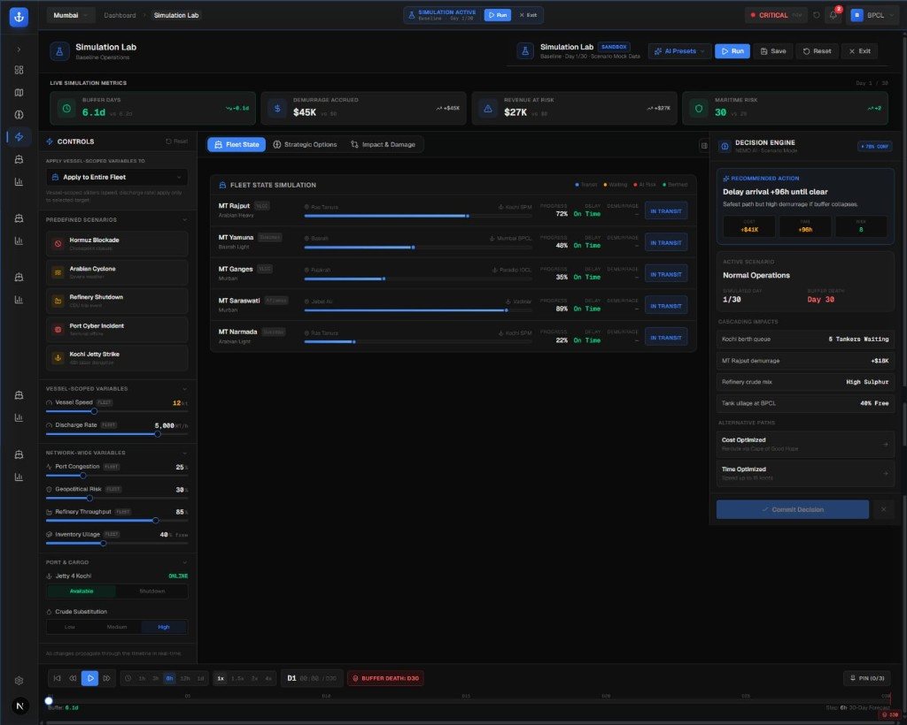

# NEMO CrudeFlow

Enterprise maritime crude logistics intelligence platform for refinery operations teams.


---

## About

NEMO CrudeFlow is a decision-intelligence platform for maritime crude supply chains.  
It helps operators monitor vessel risk, evaluate rerouting tradeoffs, simulate disruptions, and reduce demurrage/cost exposure in refinery logistics.

---

## Problem

Maritime crude logistics suffers from:

- opaque vessel and port risk visibility
- high demurrage losses during disruptions
- slow route decision cycles under uncertainty
- siloed operational data across planning teams

---

## Solution

CrudeFlow combines operational dashboards, route intelligence, simulation workflows, and AI-assisted recommendations into one platform:

- live-ish maritime operational view
- route optimization and risk weighting
- decision approval and KPI impact tracking
- scenario simulation before execution
- structured copilot support for operator queries

---

## Features

- **Dashboard** - KPI board for risk, cost, and inventory pressure.
- **Maritime Map** - current and AI-optimized route visualization.
- **Decision Engine** - approve/reject recommendations with rationale.
- **Simulation Lab** - what-if analysis for disruptions and alternatives.
- **Fleet Module** - vessel/port operational context.
- **Analytics** - trend and impact surfaces.
- **AI Copilot** - structured responses grounded in app context.

---

## Screenshots

### Dashboard


### Maritime Map


### Decision Engine


### Simulation Lab


---

## Demo Video

Place your demo artifact in `demo/` and update this link:

- Demo placeholder: `demo/nemo-crudeflow-demo-v1.mp4`

---

## Tech Stack

- **Frontend**: Next.js 16, React, TypeScript, Tailwind, Framer Motion, Leaflet
- **Backend**: FastAPI, Pydantic, Python 3.12
- **Optimization**: OR-Tools, searoute, geospatial libraries
- **Data**: PostgreSQL-ready (Neon in demo/dev context)
- **AI**: Gemma/Gemini-compatible integration path
- **Cloud**: Google Cloud Run, Artifact Registry, Secret Manager, Cloud SQL

---

## Architecture

### Frontend

- route-based app in `frontend/app/`
- reusable domain components in `frontend/components/`
- shared state via React contexts (`kpi`, `decisions`, `simulation`)

### Backend

- API routers in `backend/app/api/v1/`
- domain services in `backend/app/services/`
- optimization logic in `backend/app/optimization/`

### Data and Optimization Flow

1. Frontend requests operational data from `/api/v1/*`.
2. Backend services aggregate fleet/risk/decision/simulation context.
3. Optimization engine computes weighted risk and route tradeoffs.
4. Decision events update map/KPI state and operator workflow.

### Google Cloud Deployment Shape

- Frontend container on Cloud Run
- Backend container on Cloud Run
- Secrets in Secret Manager
- Images in Artifact Registry
- PostgreSQL on Cloud SQL (or managed external PostgreSQL)

See `docs/architecture.md` and `docs/deployment-guide.md` for details.

---

## Folder Structure

```text
crudeflow/
├── frontend/                # Next.js app
├── backend/                 # FastAPI app
├── docs/                    # Technical documentation
├── deployment/              # Cloud/deployment operational docs
├── architecture/            # Architecture artifacts and narratives
├── screenshots/             # README and submission screenshots
├── demo/                    # Demo video and scripts
├── assets/                  # Static repo assets
├── scripts/                 # Utility scripts
├── README.md
├── CONTRIBUTING.md
├── CHANGELOG.md
├── LICENSE
├── .env.example
└── docker-compose.yml
```

---

## Setup Instructions

### Prerequisites

- Node.js 20+
- Python 3.12+
- npm
- Docker (optional, for container run)

### Environment

1. Copy root env template:

```bash
cp .env.example .env
```

2. Configure backend/frontend env files as needed:

- `backend/.env` (runtime backend settings)
- `frontend/.env.local` (frontend runtime/public settings)

### Run (Windows One-Click)

```powershell
.\RUN_CRUDEFLOW.bat
```

### Run (Linux/macOS shell)

```bash
bash RUN_CRUDEFLOW.sh
```

### Local URLs

- Frontend: `http://localhost:3000/dashboard`
- Backend docs: `http://127.0.0.1:8000/docs`

---

## Deployment (Google Cloud)

This repo is prepared for container-first deployment.

### Included assets

- `frontend/Dockerfile`
- `backend/Dockerfile`
- `docker-compose.yml`
- `docs/deployment-guide.md`
- `deployment/cloud-run-backend.md`
- `deployment/cloud-run-frontend.md`
- `deployment/secrets-manager.md`

### Target services

- Cloud Run (frontend + backend)
- Artifact Registry
- Secret Manager
- Cloud SQL (PostgreSQL) or external managed PostgreSQL

---

## Future Scope

- AI agent orchestration for automated operations
- live AIS ingestion and vessel telemetry
- real-time weather and geopolitical intelligence feeds
- advanced optimization scheduler and recommendation confidence calibration

---

## Team

Aarya Tanwade

---

## Additional Documentation

- `docs/api-overview.md`
- `docs/frontend-structure.md`
- `docs/backend-structure.md`
- `docs/simulation-workflow.md`
- `docs/optimization-engine.md`

